<h1 align="center">Hi 👋, I'm Grega</h1>
<h3 align="center">A passionate deep learning entusiast and data scientist working as a Assistant Professor at the University of Maribor, Slovenia.</h3>

  

- 🔭 in free time I am working on [NiaPy](https://github.com/NiaOrg/NiaPy)

- 👨‍💻 All of my projects are available at [https://github.com/GregaVrbancic?tab=repositories&q=&type=source](https://github.com/GregaVrbancic?tab=repositories&q=&type=source)

- 📝 I sometimes write articles on [https://grega.xyz/](https://grega.xyz/)

- 💬 Ask me about **deep learning and nature inspired population based metaheuristics.**

- 📫 How to reach me **grega@grega.xyz**

